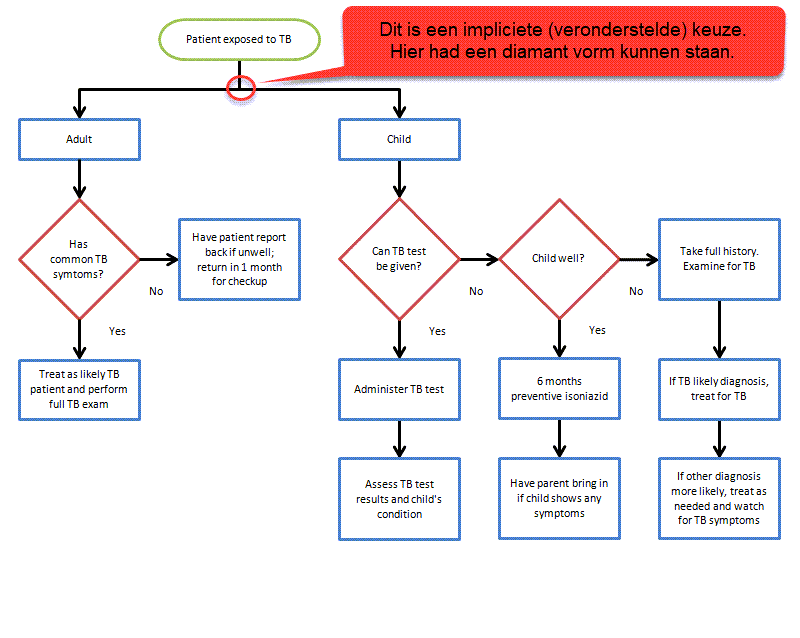
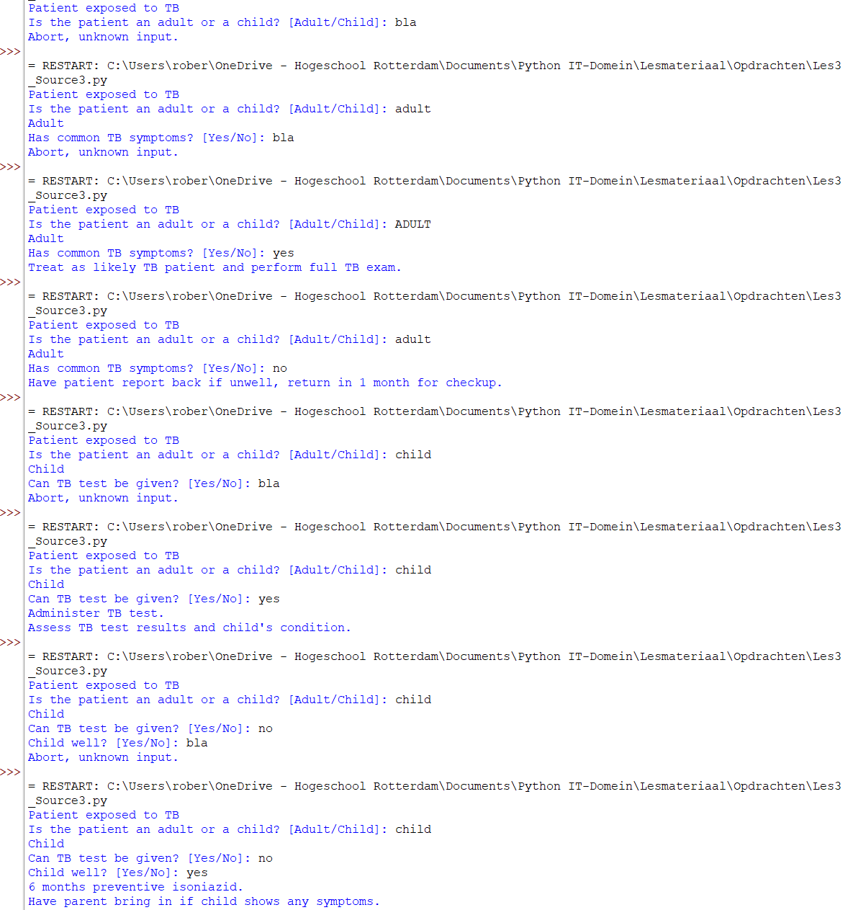
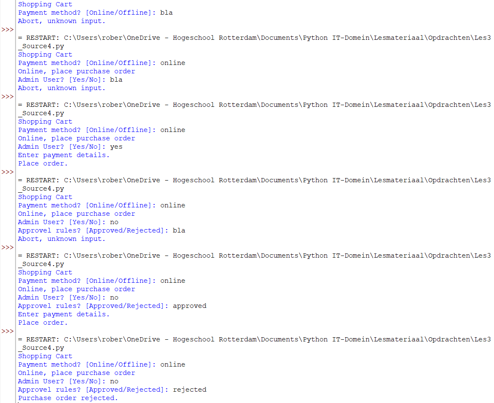
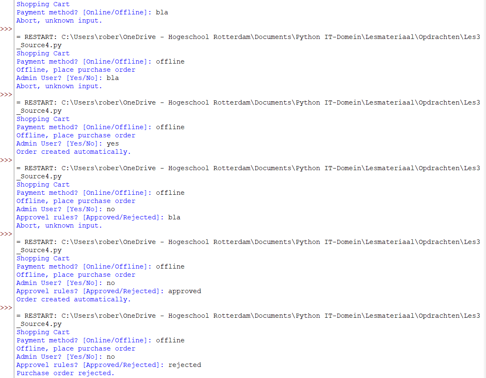
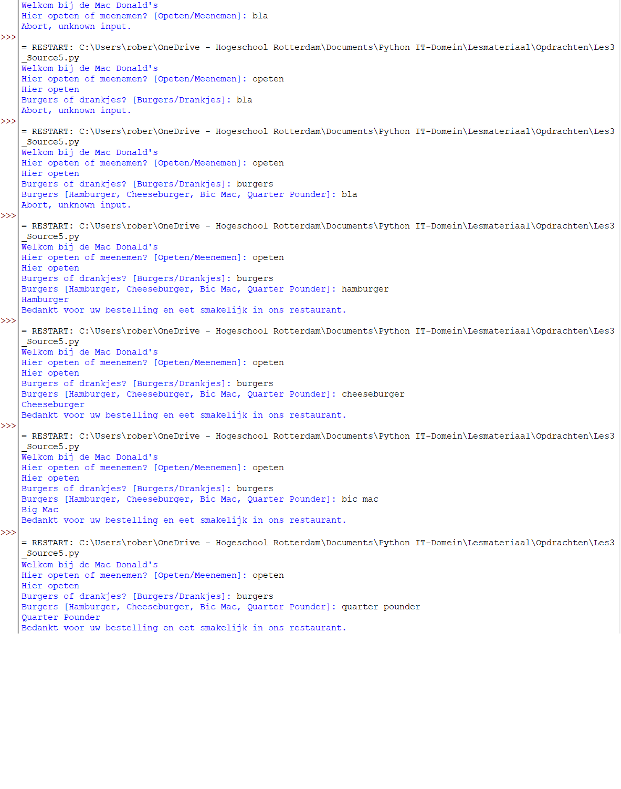
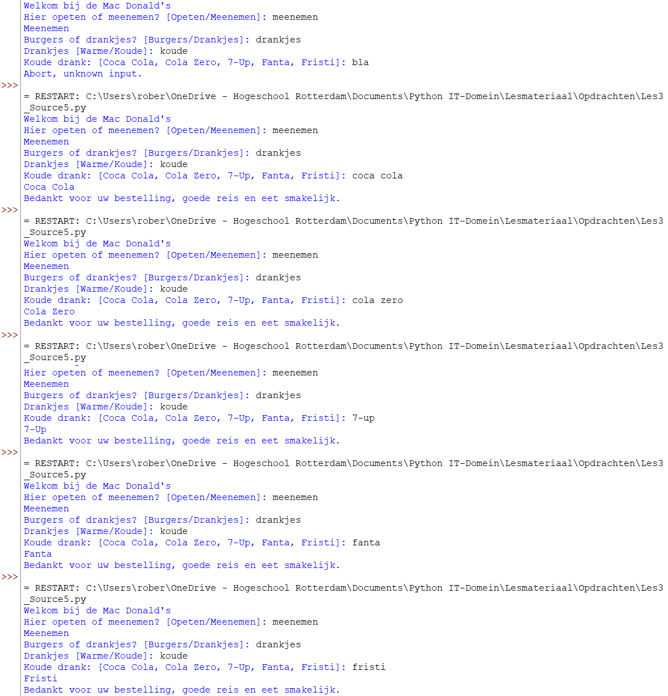

# Opdracht
Onderstaand vind je diverse opdrachten waar je mee aan de slag kunt. Type de opdrachten altijd zelf, zodat je de Python syntax in de vingers krijgt. Bij gemaakte fouten ga je de errors herkennen en leer je sneller wat je moet doen om deze te herstellen.

* Probeer vanaf hier eerst zelf de opdrachten te maken en kijk pas naar de voorgestelde code als je er niet uitkomt.

We verwijzen in volgende opdrachten misschien naar de code die je voor deze opdrachten schrijft. Het is dus belangrijk dat je deze opdrachten eerst maakt en op slaat in een bestand. Je kan dit bestand bijvoorbeeld de naam `Les3.py` geven. 

## Input vragen
Met de functie input() kan je input van de gebruiker vragen. Dat ziet eruit als:

```python
age_str = input('What is your age? ')
print(f'Your age is {age_str}')

```

### Output


De input() functie levert altijd een string terug, vandaar dat de variabele _str heeft meegekregen, om dit te benadrukken. Dit is overigens de enige plaats waarop deze toevoeging handig is.


# Internet verbindngsselectie
Vraag aan de gebruiker welke verbinding hij/zij wil gebruiken om met het internet te verbinden. Keuze uit:
- 4G
- 5G
- Wifi open

Als de gebruiker de Wifi open kiest, dan geef je een extra waarschuwing:
*"U heeft de voor de Wifi open gekozen, wij wijzen u erop dat de data door de eigenaar van dit netwerk is te lezen."*. Vervolgens stel je nog de vraag of de gebruiker nog steeds wil verbinden. Waarbij de gebruiker *"ja"* of *"nee"* kan antwoorden. Als de gebruiker met *"ja"* antwoord dan krijgt deze het standaard antwoord met de verbindingskeuzes. Bij *"nee"* of een onbekende invoer krijgt de gebruiker de melding: *"U bent niet verbonden!"*.

Bij alle andere verbindingskeuzes geef je de tekst: *"U bent verbonden via \<**hier de gekozen verbinding plaatsen**>!"*

Wanneer je onbekende invoer krijgt geef je de melding: *"Onbekende invoer, er wordt geen verbinding tot stand gebracht."*


### Output


### Uitwerking
Een voorbeeld uitwerking: [Les3_Source1.py](Uitwerkingen%2FLes3_Source1.py)


## Vergelijken met een sub-string
Controleren of een string als substring in een string zit doe je middels het keyword **in**. Bijvoorbeeld:

```python
print("Is Hello with a capital 'H' within the string 'Hello, everyone!'")
if "Hello" in "Hello, everyone!":
    print('Yes, Hello is within the Hello, everyone! string')

print("Is Hello with a lower case 'h' within the string 'Hello, everyone!'")
if "hello" in "Hello, everyone!":
    print('Yes, hello is within the Hello, everyone! string')
else:
    print('No, hello with small letters in not within the string')

```

### Output


## Flowchart
Maak een Python programma die onderstaande flowchart implementeert.
Van alle elipsen/ronde/rechthoek symbolen print je de tekst van de flowchart. De diamanten zijn je *if* statements, waar je aan de gebruiker een input vraagt. Bijvoorbeeld: yes of no antwoord.



### Output


### Uitwerking
Een voorbeeld uitwerking: [Les3_Source2.py](Uitwerkingen%2FLes3_Source2.py)

## Flowchart
Maak een Python programma die onderstaande flowchart implementeert.
Van alle elipsen/ronde/rechthoek/rechthoekgolf symbolen print je de tekst van de flowchart. De diamanten zijn je *if* statements, waar je aan de gebruiker een input vraagt. Bijvoorbeeld: *yes* of *no* antwoord.


### Output



### Uitwerking
Een voorbeeld uitwerking: [Les3_Source3.py](Uitwerkingen%2FLes3_Source3.py)

## Bestellen
Eten bestellen bij de **Mac Donald's**.
Maak een programma die aan de gebruiker de bestelling vraagt. De gebruiker kan slechts 1 keuze maken. Dat wil zeggen dat hij/zij slechts 1 burger of 1 drankje kan kiezen. 
De volgende vragen stel je aan de gebruiker:
- Hier opeten of meenemen?
- Burgers of drankjes?
    - Burgers:
        - Hamburger
        - Cheese burger
        - Big Mac
        - Quarter Pounder met of zonder kaas?
    - Drankjes:
        - Warme of koude drankjes:
            - Warme drankjes:
                - Koffie
                - Cappucino
                - Chocolademelk
            - Koude drankjes:
                - Coca Cola
                - Cola Zero
                - 7-up
                - Fanta
                - Fristi

Elke keer als de gebruiker een bestelling kiest geef je deze op het scherm weer.
Als de gebruiker *"hier op eten"* heeft gekozen, dan zeg je aan het einde: "*Bedankt voor uw bestelling en eet smakelijk in ons restaurant.*"
Als de gebruiker *"Meenemen"* heeft gekozen, dan zeg je aan het einde: "*Bedankt voor uw bestelling, goede reis en eet smakelijk.*"

### Output




### Uitwerking
Een voorbeeld uitwerking: [Les3_Source4.py](Uitwerkingen%2FLes3_Source4.py)